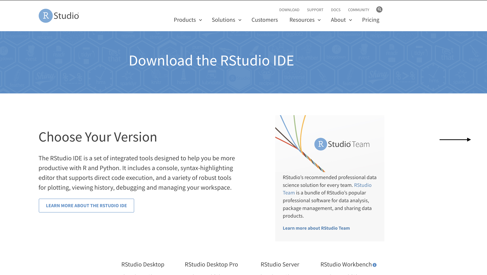
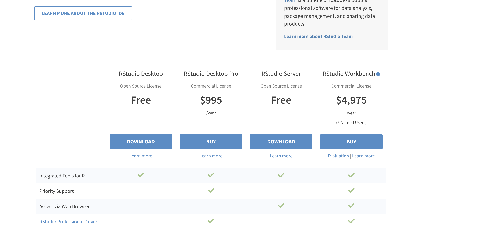
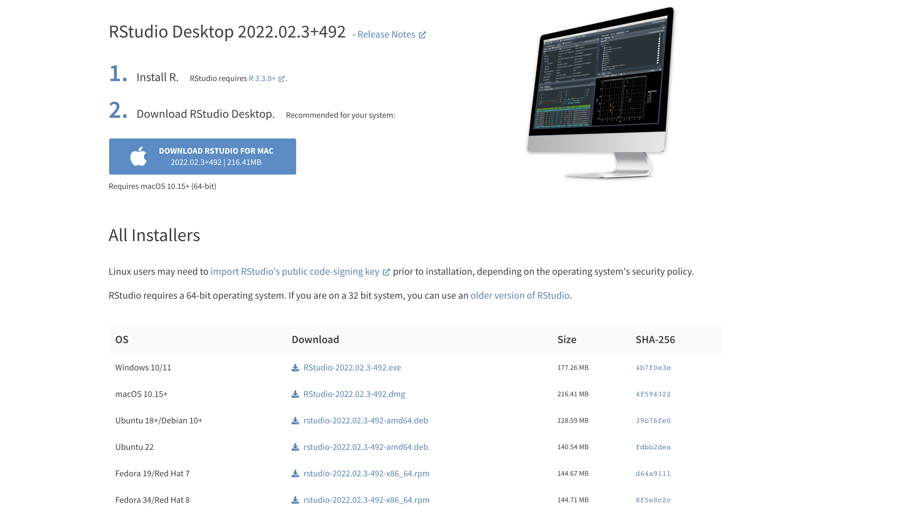
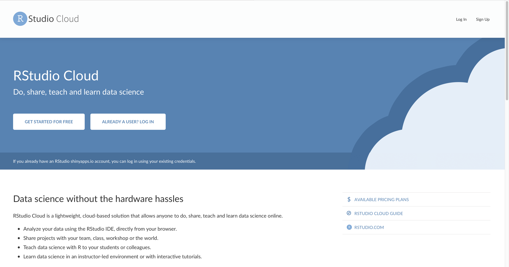
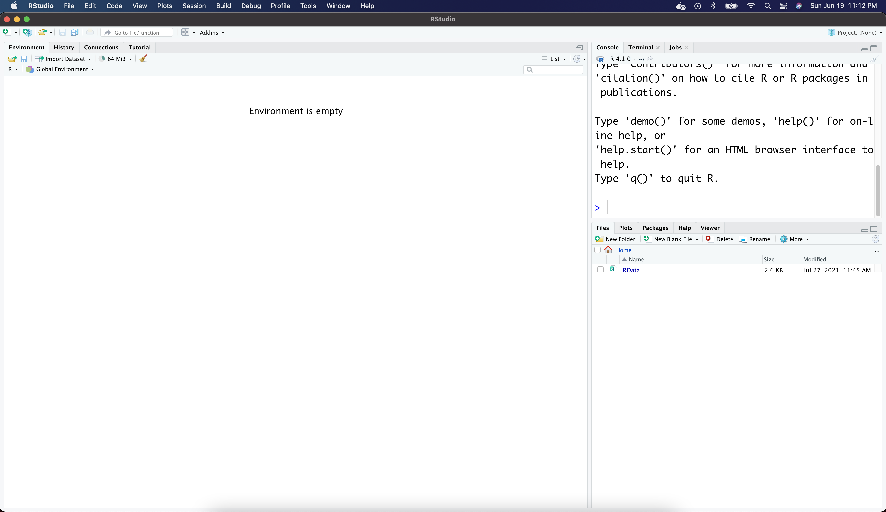

```{r setup, include=FALSE}
knitr::opts_chunk$set(echo = TRUE)
```

## Welcome

It's good to have you join our class. We are excited that you are taking this bold step to start your journey to learn R! Let's get started!

## Getting started

### How to install R and RStudio

To get yourself ready to start a journey learning r programming, you need to get a computer system that has R installed on it and an IDE that makes learning easy and fun like RStudio. You can get this done by following this steps in order:

1.  Install R Download R for Mac by opening this link [mac](https://cran.r-project.org/bin/macosx/) or this link for [windows](https://cran.r-project.org/bin/windows/base/). The links would open a web page showing you how to download the appropriate files right for your computer's operating system. Install R by double-clicking the downloaded and follow ths simple promts and default selected options to complete your installation. When you are done with this installation, follow the next step below.

2.  Install RStudio IDE Click this link [rstudio IDE](https://www.rstudio.com/products/rstudio/download/) to download the installation file. Scroll down the web page to click the button for the **RStudio FREE download** option. <br>

| Download landing page                          | Scroll down to download option                 |
|-----------------------------------|------------------------------------|
|  |  |

By clicking the button, you are taken to a page which automatically detects your operating system and display the right file for you to download.



<br>

Double-click the downloaded file and follow the prompt to install your IDE. That's it!

### RStudio cloud

RStudio Cloud is another product from [rstudio](rstudio.com) which gives you a lightweight, cloud-based version of RStudio Desktop IDE that allows you work with your r scripts, projects online and also share with your colleagues. 

<br> 

 

<br> 

## Customize your RStudio IDE

RStudio IDE provides options for you to customize your working enviroment to suit your personality. These options are accessible from the Options dialog via Tools > Options menu. Let's take a walkthrough in the RStudio IDE to do the customization together.

## RStudio IDE Panes
- source
- console
- environment 
- files, plots, packages, etc



<br>

## Files and Project structure in RStudio

- Files: scripts, data files, etc
- Projects: New Project, R Package, other project types

<br>

## Set and get working directory

```{r}
# insert your directory location or address into the double quotation mark
setwd("images/alison/")

# get and display working directory location or address
getwd()
```


<br>

## Getting help and resources

- type question mark before a function or package name to get more information as show below

```{r}
?janitor
```

- get specific package related to your field or profession from CRAN online using the search format as shown. **https://cran.r-project.org› package=packagename**

- search on stackoverflow, Google, build your network

<br>

## Install and load packages in R

### What is a package?


```{r}

# installing a single package with base R
# install.packages("pacman")

# installing multiple packages with base R
# install.packages(c("tidyverse", "xlsx", "lubridate", "skimr", "janitor", "rmarkdown", "rio", "here"))
```

<br>

```{r}
# Installing (if necessary) and load packages using pacman package
# pacman::p_load(tidyverse, lubridate, xlsx, skimr, janitor, rmarkdown, rio, here)
```

<br>

You are ready to begin writing your first code! 

<br> 

**Thank you!**

<br>
